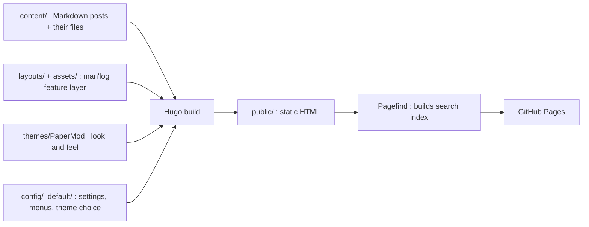

# man'log

Source for [gudurumanoj.github.io](https://gudurumanoj.github.io/): a personal site with a
landing page and a blog of learning notes, built with [Hugo](https://gohugo.io/) and deployed
to GitHub Pages by GitHub Actions.

- **This file** explains how the repository is put together: layout, architecture, build,
  deploy, and how to swap the theme.
- **[WRITING.md](WRITING.md)** is the day-to-day guide: writing posts, adding images, math,
  diagrams and demos, tags, categories, and nav bar entries.

## Site map

| URL | What it shows | Rendered by |
|-----|---------------|-------------|
| `/` | Personal landing page: name, photo/monogram, social links, intro text | `layouts/home.html` |
| `/blog/` | All posts as a paginated card grid with category chips and a search button | `layouts/blog/list.html` |
| `/blog/<category>/` | Same grid, filtered to one folder | `layouts/blog/list.html` |
| `/blog/<category>/<post>/` | A post | the theme's single-page template |
| `/tags/`, `/tags/<tag>/` | Tag list; card grid per tag | theme (`/tags/`), `layouts/term.html` |
| `/archives/` | Every post by year | theme (PaperMod `archives` layout) |
| `/search/` | Full search page with tag/category filters | `layouts/pagefind.html` |

Only **Blog** is in the nav bar. Tags, the archive and search are reached from the blog page
(tag chips on cards, the search button, Ctrl/Cmd+K) or by URL.

## Repository layout

```
.
├── config/_default/
│   ├── hugo.toml        # site title, baseURL, theme, Markdown/math settings, pagination
│   ├── params.toml      # [manlog] settings for our layer + theme-specific params
│   └── menus.toml       # top navigation bar
├── content/             # everything you write (Markdown)
│   ├── _index.md        # landing page text (your intro)
│   ├── search.md, archives.md
│   └── blog/
│       ├── _index.md            # /blog/ title + description
│       ├── <category>/_index.md # one folder per category (ml, math, cp, ...)
│       └── <category>/<post>/index.md  # one folder per post ("page bundle")
├── layouts/             # man'log feature layer (overrides/extends the theme)
│   ├── home.html                  # landing page
│   ├── blog/list.html             # card grid for /blog/ and every category
│   ├── term.html                  # card grid for /tags/<tag>/
│   ├── pagefind.html              # search page
│   ├── _markup/
│   │   ├── render-passthrough.html        # $...$ / $$...$$ -> KaTeX HTML at build time
│   │   └── render-codeblock-mermaid.html  # ```mermaid blocks -> diagrams
│   ├── _shortcodes/
│   │   ├── embed.html             #  iframe for HTML demos / Claude artifacts
│   │   └── video.html             #  looping clips
│   └── _partials/
│       ├── manlog/head-extras.html  # the one place our CSS/JS gets added to <head>
│       ├── manlog/card.html         # one post card
│       ├── manlog/listing.html      # shared grid page (header, chips, grid, pagination)
│       ├── manlog/pagination.html
│       ├── manlog/icon.html         # social icons
│       ├── extend_head.html         # theme hook shims: each is one line that
│       ├── extend-head.html         #   includes manlog/head-extras.html, under the
│       ├── head-additions.html      #   hook names used by PaperMod, Blowfish/Congo,
│       └── head/custom.html         #   Ananke and Stack respectively
├── assets/
│   ├── css/manlog.css     # styles for cards, landing, TOC rail, embeds, search
│   └── js/
│       ├── toc-rail.js    # right-side contents rail on posts
│       └── mermaid-init.js
├── archetypes/blog.md     # front matter template used by `hugo new blog/...`
├── static/                # copied as-is: favicons, webmanifest, (optional) avatar
├── themes/PaperMod/       # current theme (git submodule)
├── pagefind.yml           # what the search index includes
└── .github/workflows/hugo.yml   # build + deploy to GitHub Pages
```

## Architecture

The site is three layers. Hugo merges them at build time; a file in the project's
`layouts/` always wins over a file with the same name in the theme.



1. **Content** (`content/`) is plain Markdown with front matter. It contains no theme-specific
   shortcodes, so it moves between themes untouched.
2. **The man'log layer** (`layouts/`, `assets/`) owns every feature that matters: math, Mermaid,
   embeds, cards, the landing page, the contents rail, and search. Our page templates only fill
   the `main` block, which nearly every Hugo theme defines, so the theme still draws the header,
   footer and fonts around them. Colours come from the theme's CSS variables when present, with
   fallbacks.
3. **The theme** (`themes/PaperMod`) controls the look: header, nav bar, footer, typography,
   and the single-post page. The site is light-only: `defaultTheme = "light"` and
   `disableThemeToggle = true` in `params.toml`. Colours follow posttrainbench.com (warm cream
   with a terracotta accent). PaperMod's colours are overridden in
   `assets/css/extended/palette.css`, and the accent lives in `--ml-accent` in
   `assets/css/manlog.css`. To bring dark mode back, set `disableThemeToggle = false`.

### How each feature works

- **Math**: Goldmark's `passthrough` extension (in `hugo.toml`) hands everything between
  `$...$`, `$$...$$`, `\(...\)` and `\[...\]` to `render-passthrough.html`, which calls
  `transform.ToMath` (KaTeX compiled into Hugo). The HTML is produced at build time, so
  readers download only the KaTeX stylesheet. The stylesheet is added only to pages that
  contain math, and its version (`katexCSS` in `params.toml`) must match the KaTeX version
  bundled with Hugo.
- **Mermaid**: `render-codeblock-mermaid.html` turns ` ```mermaid ` blocks into
  `<pre class="mermaid">` and flags the page; `head-extras.html` then loads
  `mermaid-init.js` (Mermaid from a CDN) only on flagged pages. Light diagrams use the
  site palette, and diagrams re-render if the theme ever switches to dark.
- **Embeds**: only Markdown counts as content (`[contentTypes]` in `hugo.toml`), so an HTML
  file in a post folder is published as a plain file. `` points an iframe at it.
- **Cards**: `card.html` uses `thumbnail:` from front matter, else any `cover.*` file in the
  post folder (resized to 800x450 WebP), else a generated tile coloured by the first tag.
- **Contents rail**: `toc-rail.js` reads the `h2`/`h3` headings of the rendered post, so it does
  not depend on the theme's templates. It is loaded on posts under `blog/` unless the post sets
  `toc: false`, and shows when a post has at least `tocMinHeadings` headings.
- **Search**: after Hugo builds `public/`, Pagefind indexes post pages (`pagefind.yml` limits it
  to `blog/**/index.html`; listing pages opt out with `data-pagefind-ignore`). Tags and
  categories become search filters via `<meta data-pagefind-filter>` tags in `head-extras.html`.
  The index is static files under `/pagefind/`; there is no server.
- **Favicon**: the wood-log emoji from [Twemoji](https://github.com/jdecked/twemoji)
  (CC-BY 4.0). `static/favicon.svg` plus PNG/ICO fallbacks, referenced by PaperMod's
  `params.assets` and by `head-extras.html`; the header logo uses the same SVG. To change it,
  replace those files (any square image works).

## Local development

Publishing needs nothing on your machine: GitHub Actions installs Hugo and Pagefind and
builds the site on every push. Everything below is only for previewing posts locally.

### Setting up on a new machine

**1. Clone with the theme submodule.** PaperMod lives in `themes/PaperMod` as a git
submodule (a pointer to a theme commit, not the files themselves). A plain `git clone` leaves
that folder empty and the build fails, so clone with:

```bash
git clone --recurse-submodules https://github.com/gudurumanoj/gudurumanoj.github.io.git
cd gudurumanoj.github.io
```

If you already cloned without the flag, fetch the theme with
`git submodule update --init --recursive`.

**2. Install Hugo extended, matching the version CI uses** (`HUGO_VERSION` in
`.github/workflows/hugo.yml`, currently 0.167.0). It is a single binary:

```bash
# Linux (Debian/Ubuntu, needs sudo)
wget https://github.com/gohugoio/hugo/releases/download/v0.167.0/hugo_extended_0.167.0_linux-amd64.deb
sudo dpkg -i hugo_extended_0.167.0_linux-amd64.deb

# Linux without sudo: unpack the binary into ~/.local/bin (make sure it is on your PATH)
mkdir -p ~/.local/bin
curl -L https://github.com/gohugoio/hugo/releases/download/v0.167.0/hugo_extended_0.167.0_linux-amd64.tar.gz \
  | tar -xz -C ~/.local/bin hugo

# macOS
brew install hugo

hugo version   # should print v0.167.0+extended
```

Use 0.166 or newer: the layouts use Hugo's newer template folder structure, and the
math stylesheet (`katexCSS` in `params.toml`) is pinned to the KaTeX version bundled with
Hugo 0.166+, so older versions render equations wrongly.

**3. Preview.** This serves the site with drafts at http://localhost:1313 and reloads on save:

```bash
hugo server -D
```

**4. (Optional) Make search work locally.** `hugo server` does not build the Pagefind search
index, so the search page and Ctrl/Cmd+K show no results until you build it once into
`static/pagefind/` (git-ignored, never committed):

```bash
hugo -D
npx -y pagefind --site public --output-path static/pagefind      # needs Node.js
# or, with Python instead of Node:
# pip install 'pagefind[extended]' && python -m pagefind --site public --output-path static/pagefind
hugo server -D
```

Re-run the Pagefind step whenever you want search to pick up new posts.

Notes:

- KaTeX's stylesheet and Mermaid load from a CDN, so pages with math or diagrams need an
  internet connection to render properly in the preview.
- To push from the new machine, sign in to GitHub first (`gh auth login`, or set up SSH
  keys). The live site updates about a minute after each push to `master`.
- Delete `public/`, `resources/` and `.hugo_build.lock` whenever you like; they are
  build output and are git-ignored.

## Deployment

`.github/workflows/hugo.yml` runs on every push to `main` or `master`:

1. Installs Hugo extended (version pinned in `HUGO_VERSION`).
2. Checks out the repo **with submodules** (the theme).
3. Runs `hugo --gc --minify` to build `public/`.
4. Runs `npx pagefind --site public` to build the search index.
5. Uploads `public/` and deploys it to GitHub Pages.

### One-time setup

1. Create a **public** repository named exactly `gudurumanoj.github.io` on GitHub.
2. Push this repo to it:
   ```bash
   git remote add origin https://github.com/gudurumanoj/gudurumanoj.github.io.git
   git push -u origin master
   ```
3. In the repository, go to **Settings > Pages > Build and deployment** and set **Source** to
   **GitHub Actions**.
4. Watch the run under the **Actions** tab. The site will be at https://gudurumanoj.github.io/.

Drafts (`draft: true`) are never published; only `hugo server -D` shows them.

## Swapping the theme

The goal is that switching themes is a one-line change in `config/_default/hugo.toml`.

1. Add the new theme as a submodule:
   ```bash
   git submodule add https://github.com/<owner>/<theme>.git themes/<theme>
   ```
2. Set `theme = "<theme>"` in `config/_default/hugo.toml`.
3. Run `hugo server -D` and check the list below.

Shims for the head hooks of **PaperMod, Blowfish, Congo, Ananke and Stack** already exist in
`layouts/_partials/`. For another theme, find the partial its `<head>` template includes for
custom code (often named `extend_head`, `custom-head` or similar) and add a one-line file with
that name:

```go-html-template
{{- partial "manlog/head-extras.html" . -}}
```

Things to check after a swap:

- Landing page, `/blog/` grid, a category page, a tag page and `/search/` render inside the new
  theme's header and footer.
- A post shows math, Mermaid diagrams, the embedded demo, and the contents rail (open the
  feature-tour post).
- The nav bar uses `menus.toml`. Most themes read `[[main]]`; a few use a different menu name.
- Theme-specific settings live at the bottom of `params.toml`. Unknown keys are ignored, so
  settings for several themes can sit side by side. The `/archives/` page uses PaperMod's
  `archives` layout; other themes may need their own archive page or can drop the menu entry.
- Some themes add their own page header (Ananke shows a big title banner) above our grid pages.
  Adjust with that theme's options or a small CSS override in `assets/css/manlog.css`.

A custom theme (for example one styled after a lab blog you like) is just another folder under
`themes/` with `baseof.html`, `single.html`, header and footer partials. Our layer keeps working
as long as it defines a `main` block and includes the head shim.

## Updating things

- **Theme**: `git submodule update --remote themes/PaperMod`, then preview.
- **Hugo**: bump `HUGO_VERSION` in the workflow. If Hugo's bundled KaTeX changed (see its release
  notes), update `katexCSS` in `params.toml` to the matching version.
- **Mermaid**: `mermaidJS` in `params.toml` (currently the latest 11.x from jsDelivr).
