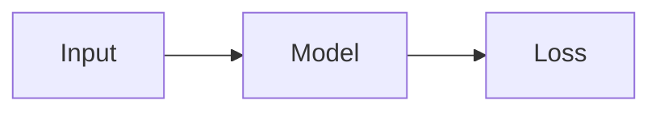

# Writing for man'log

How to add posts and everything that goes in them, organise them with categories and tags,
and change the landing page and nav bar. For how the repo is built, see [README.md](README.md).

The post [A Tour of man'log](content/blog/building-blocks/manlog-feature-tour/index.md) uses
every feature below. Keep it open as a live example.

## Quick start

```bash
hugo new blog/ml/attention-from-scratch/index.md   # creates the post from archetypes/blog.md
hugo server -D                                     # preview at http://localhost:1313
```

Write the post, set `draft: false`, commit and push. GitHub Actions publishes it in a minute
or two.

## Where posts live

Every post is a folder (a "page bundle") inside a category folder:

```
content/blog/
├── _index.md                       # the /blog/ page title and description
├── ml/
│   ├── _index.md                   # the ML category: title, description, order
│   └── attention-from-scratch/     # one post = one folder; the folder name is the URL slug
│       ├── index.md                # the post itself
│       ├── cover.png               # optional card image (picked up automatically)
│       ├── fig-attention.png       # images, GIFs, videos, HTML demos used by the post
│       └── demo.html
└── math/ ...
```

URL of that post: `/blog/ml/attention-from-scratch/`.

Rules:
- The post file must be named `index.md`, inside its own folder.
- The folder name becomes the URL, so use lowercase words with hyphens.
- Put the post's files in the same folder and refer to them by file name.

## Front matter

The block between `---` lines at the top of `index.md`:

```yaml
---
title: "Attention From Scratch"        # required
date: 2026-10-07T09:00:00+05:30        # required; sets ordering (newest first)
draft: true                            # required; set to false to publish
tags: ["ml", "building-block"]         # optional, but recommended
summary: "One or two sentences shown on the card and in search results."  # recommended
thumbnail: diagram.png                 # optional; overrides the automatic cover.* lookup
toc: false                             # optional; hides the right-side contents rail
description: "Short subtitle shown under the title on the post page."      # optional
---
```

| Field | Required | Effect |
|-------|----------|--------|
| `title` | yes | Post title, card title, browser tab title |
| `date` | yes | Sorting and the date on cards. A future date stays hidden until then |
| `draft` | yes | `true` = only visible with `hugo server -D`; never published |
| `tags` | no | Chips on the card; creates `/tags/<tag>/`; search filter |
| `summary` | no | Card text and search excerpt. Without it, the first ~40 words are used |
| `thumbnail` | no | Card image file in the post folder. Default: any `cover.*` file, else a generated tile |
| `toc` | no | `false` hides the contents rail. It shows automatically on posts with 3+ `##`/`###` headings |
| `description` | no | Subtitle under the post title |

## Tags

Use lowercase, hyphenated tags and reuse existing ones so the filters stay useful:

| Tag | Use for |
|-----|---------|
| `building-block` | Self-contained explainers of a core idea |
| `ml` | Machine learning |
| `math` | Math |
| `cp` | Competitive programming |
| `random-thoughts` | Opinions, musings, half-baked ideas |

Add new tags freely: writing a new tag in a post's front matter is all it takes to create it.
The tag pages and search filters appear on the next build.

**Categories vs tags**: the folder is the category (one per post, shown as a chip row on
`/blog/`); tags are many per post and cut across categories.

A post with several tags shows up on each of those tag pages (`/tags/ml/`, `/tags/math/`, ...)
and shows all its tags as chips on its card. On `/search/`, the **Tags** filter lists every tag
with a post count and works without typing a query. Ticking several tags narrows the results
to posts that have **all** of them; options that would give zero results are hidden.

## Images, GIFs and video

```markdown


```

For a visible caption or a custom width, use Hugo's built-in `figure` shortcode:

```markdown

```

GIFs work exactly like images. For anything longer than a few seconds, export an MP4 instead
(it's usually 5-10x smaller) and use:

```markdown
           <!-- loops silently, like a GIF -->
                            <!-- normal player -->
```

**Card cover**: drop a `cover.png` (or `.jpg`/`.webp`) into the post folder. A 16:9 image of
at least 1200x675 looks best; it is cropped and resized automatically. Without one, the card
shows a coloured tile with the title.

## Code and commands

Use fenced code blocks with a language for syntax highlighting. A copy button appears on hover.

````markdown
```python
def softmax(x):
    e = np.exp(x - x.max())
    return e / e.sum()
```

```bash
pip install torch
```
````

## Math (LaTeX)

| You write | Result |
|-----------|--------|
| `$x^2$` or `\(x^2\)` | inline math |
| `$$ ... $$` or `\[ ... \]` on their own lines | display (centred) math |

```markdown
The softmax of $z$ is

$$
\sigma(z)_i = \frac{e^{z_i}}{\sum_j e^{z_j}}
$$

$$
\begin{aligned}
a &= b + c \\
d &= e
\end{aligned}
$$
```

- Math is rendered when the site is built, so a typo shows up as a **warning in the
  `hugo server` output** and the formula appears in red on the page.
- To write a literal dollar sign, escape it: `\$5`.
- Anything KaTeX supports works: `\mathbb`, `\operatorname`, `aligned`, `cases`, `pmatrix`,
  and more ([full list](https://katex.org/docs/supported.html)).

## Diagrams (Mermaid)

````markdown

````

Any Mermaid diagram type works (flowchart, sequence, class, state, gantt, pie, and more). See the
[Mermaid docs](https://mermaid.js.org/intro/). Diagrams use the site palette (set in `assets/js/mermaid-init.js`).

## Interactive demos and Claude artifacts

Any self-contained HTML page can be embedded in a post:

1. In Claude, ask: *"Export this artifact as a single, self-contained HTML file (inline all
   JS/CSS, load libraries from a CDN)."* For React artifacts, Claude can produce an HTML file
   that loads React from a CDN.
2. Save it into the post folder, e.g. `demo.html`.
3. Embed it:

```markdown

```

| Parameter | Default | Meaning |
|-----------|---------|---------|
| `src` | required | File in the post folder, or a full URL |
| `height` | `480` | Height in pixels |
| `caption` | none | Text under the demo (Markdown allowed) |
| `title` | caption | Accessible title for screen readers |

An "Open full screen" link is shown under every embed. External URLs work too, but many sites
(including claude.ai share links) refuse to be embedded, so saving the file locally is the
reliable route.

## Other handy bits

```markdown
Footnotes work.[^1]

[^1]: Like this.

> Block quotes for definitions or quotations.

<details>
<summary>Click to expand</summary>

Long proofs or optional detail. Leave a blank line after <summary>.

</details>
```

Tables use standard Markdown pipes. Raw HTML is allowed anywhere.

## Headings and the contents rail

- Start sections at `##`. The post title is the only `#`.
- `##` and `###` headings appear in the rail on the right (longer ticks for `##`); hovering it
  lists them, and clicking jumps there. On phones it becomes a "Contents" button at the
  bottom left.
- It appears when a post has at least 3 such headings (`tocMinHeadings` in
  `config/_default/params.toml`), and can be turned off per post with `toc: false`.

## Categories

To add a category, create a folder with an `_index.md`:

```bash
mkdir -p content/blog/systems
```

```yaml
# content/blog/systems/_index.md
---
title: "Systems"
description: "Distributed systems, GPUs, and performance."
weight: 50          # chip order on /blog/ (lower = further left)
---
```

It appears as a chip on `/blog/` and gets its own page at `/blog/systems/`. Categories can be
nested (`content/blog/ml/transformers/_index.md`); posts in sub-folders still appear on
`/blog/` and on every parent category page.

## The landing page

- **Text**: edit `content/_index.md` (normal Markdown).
- **Name, tagline, photo, social links, number of recent posts**: edit the `[manlog]` section
  of `config/_default/params.toml`. For a photo, put a square image at
  `static/images/avatar.jpg` and set `avatar = "images/avatar.jpg"`.
- **Social icons available**: `github`, `x`, `linkedin`, `email`, `scholar`, `rss`, `link`.

```toml
[[manlog.socials]]
  name = "Email"
  url = "mailto:you@example.com"
  icon = "email"
```

## The nav bar

Items come from `config/_default/menus.toml`. Lower `weight` = further left.

**Link to an existing page or an external site**:

```toml
[[main]]
  name = "CV"
  url = "/cv.pdf"          # file placed at static/cv.pdf
  weight = 60

[[main]]
  name = "GitHub"
  url = "https://github.com/gudurumanoj"
  weight = 70
```

**Add a new top-level section** (e.g. `/projects/`):

1. Create `content/projects/_index.md`:
   ```yaml
   ---
   title: "Projects"
   description: "Things I've built."
   ---
   ```
2. Add pages as `content/projects/<name>/index.md`, with the same front matter as posts.
3. Add the menu entry:
   ```toml
   [[main]]
     name = "Projects"
     url = "/projects/"
     weight = 15
   ```

By default the section uses the theme's plain list. To give it the same card grid as the blog,
create `layouts/projects/list.html` containing:

```go-html-template
{{- define "main" }}
{{- partial "manlog/listing.html" (dict "page" . "pages" .RegularPagesRecursive) }}
{{- end }}
```

**A single standalone page** (like About): create `content/now.md` with a `title`, write
Markdown below it, and add a `[[main]]` entry with `url = "/now/"`.

To remove an item, delete its `[[main]]` block.

## Publishing checklist

1. `draft: false`, and the `date` is not in the future.
2. `hugo server -D` shows no warnings for the post (math errors are reported here).
3. Images and demos load, and the card looks right on `/blog/`.
4. Commit and push. Check the **Actions** tab if the site doesn't update within a few minutes.

## The sample content

The repo ships with one published post (the feature tour) and three short **drafts**
(`ml/softmax-numerical-stability`, `cp/prefix-sums`, `thoughts/why-keep-a-log`) that exist to
fill the grid while previewing. Delete or rewrite them whenever you like; the drafts never
appear on the live site.
