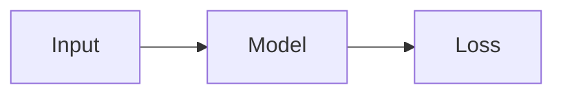

# Writing a man'log post

Everything needed is below. **Do not explore `layouts/`, `assets/` or config to write a post.**
Only touch the post's own folder. Never commit or push (the owner does git).

## Steps

1. Pick a slug: lowercase-hyphenated, it becomes the permanent URL. Posts are flat (no category
   folders); topics come only from tags.
2. Create `content/blog/<slug>/index.md` (the file must be named `index.md`) with the
   front matter below. Put images/GIFs/demos in the same folder and refer to them by file name.
3. Write the post.
4. Validate: `hugo -D --renderToMemory 2>&1 | grep -E "WARN|ERROR" | grep -v "deprecated: .Language"`
   (on the owner's machine `hugo` is `~/.local/bin/hugo`). No output = OK. Math errors show here.
5. Report the file path and URL (`/blog/<slug>/`). Leave `draft: true` unless the
   user asked to publish.

## Front matter

```yaml
---
title: "Attention From Scratch"
date: 2026-10-07T09:00:00+05:30     # IST; a future date hides the post until then
draft: true
tags: ["ml", "building-block"]
summary: "One or two sentences for the card and search results."
# thumbnail: diagram.png            # card image; default is any cover.* in the folder
# toc: false                        # hide the right-side contents rail
# description: "Subtitle under the title on the post page."
---
```

Tags: lowercase, hyphenated, usually 2-5 per post; reuse existing ones: `building-block`, `ml`,
`math`, `cp`, `random-thoughts`, `meta`, `python`, `code`, `infra`, `interview`. New tags are fine
when nothing fits: writing a tag creates its page, its chip in the `/blog/` tag bar and its search
filter automatically. Never rename a post's folder; if unavoidable, add
`aliases: ["/blog/old-slug/"]` to its front matter.

Card image: a `cover.png|jpg|webp` (16:9, ≥1200x675) in the folder is used automatically;
otherwise a coloured tile with the title is generated. Don't create one unless asked.

## Writing style

- First person, as Manoj. Lead with the idea; short paragraphs; concrete examples.
- Use `##` sections (and `###` subsections). Three or more give the post a hover contents rail.
- Don't invent personal facts, results, or citations. Mark gaps as `TODO:` for the owner.

## Syntax cheat sheet

**Images / GIFs**: ``. With caption or width:
``

**Video** (prefer MP4 over long GIFs):
`` (loops silently) or ``

**Code**: fenced blocks with a language (` ```python `, ` ```bash `, ` ```text ` for output). Each
becomes a collapsible, height-capped panel with copy / show all automatically. Optional:
` ```python {title="bench.py"} ` (header label, e.g. a file name or "Output") and
` ```text {collapsed=true} ` (starts closed). Give long scripts and their outputs a `title`.

**Math** (KaTeX at build time): inline `$x^2$` or `\(x^2\)`; display `$$ ... $$` or `\[ ... \]`
on their own lines; `aligned`, `cases`, `pmatrix`, `\mathbb` etc. work. Literal dollar: `\$5`.

**Mermaid** (auto-layout, site colours applied automatically):

````markdown

````

**SVG diagram** (exact layout). Paste raw; **no blank lines between `<figure>` and `</figure>`**.
Colours come from CSS classes, so write only coordinates and text:

```html
<figure class="ml-diagram">
<svg viewBox="0 0 860 230" role="img" aria-label="What the diagram shows">
  <defs><marker id="ml-arrow" viewBox="0 0 10 10" refX="9" refY="5" markerWidth="7" markerHeight="7" orient="auto-start-reverse"><path d="M0,0 L10,5 L0,10 z"/></marker></defs>
  <rect class="group" x="20" y="10" width="540" height="160" rx="14"/>
  <text class="label" x="290" y="40">Group label</text>
  <rect class="box violet" x="45" y="62" width="220" height="80" rx="8"/>
  <text class="name" x="155" y="96">First step</text>
  <text class="note violet" x="155" y="120">What it does</text>
  <rect class="box green" x="320" y="62" width="220" height="80" rx="8"/>
  <text class="name" x="430" y="96">Second step</text>
  <text class="note green" x="430" y="120">What it does</text>
  <line class="arrow" x1="268" y1="102" x2="316" y2="102"/>
  <path class="arrow dashed" d="M155,145 V200 H430 V145"/>
</svg>
<figcaption>Optional caption.</figcaption>
</figure>
```

- Box colours: `box violet|green|blue|rose|sand` (or plain `box`); `group` = dashed outline.
- Text: `name` (bold title, ~34 below box top), `note <colour>` (second line, ~58 below), `label`;
  add `left` to left-align. Text x = box centre (`x + width/2`).
- Arrows: `arrow` (head at end), add `both`, `dashed`, or `plain`; stop ~4 units short of boxes.
  Elbows: `<path d="M x,y V y2 H x2">`. Columns that fit: x = 45, 320, 595 (width 220); next
  row: y + 150-170. Keep the `<defs>` line in every diagram.

**Interactive demo / Claude artifact**: save a self-contained HTML file in the post folder, then
``
(adds an "Open full screen" link). Match the site palette in demos: background `#fdfcf8`,
text `#2d2a23`, accent `#a66b4f`.

**Other**: footnotes `[^1]`, tables, blockquotes, `<details><summary>...</summary>...</details>`,
and emoji shortcodes (`:tada:`) all work.

Reference post using every feature: `content/blog/manlog-feature-tour/index.md`.
