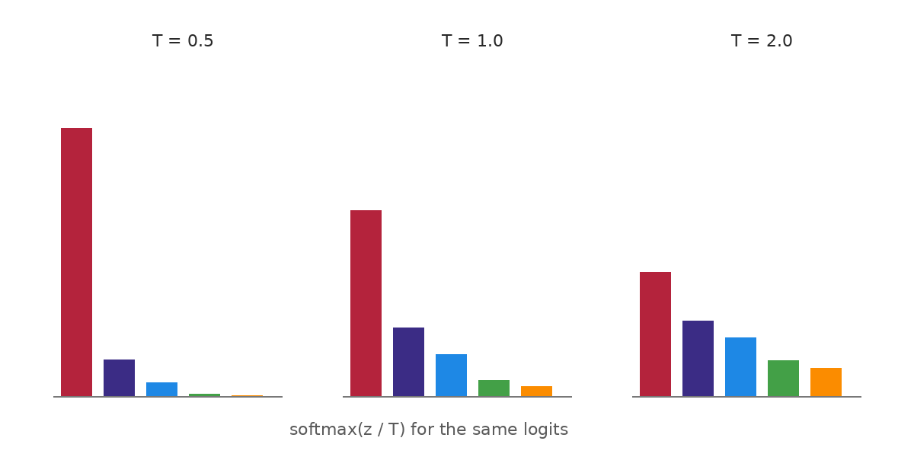
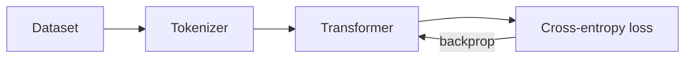
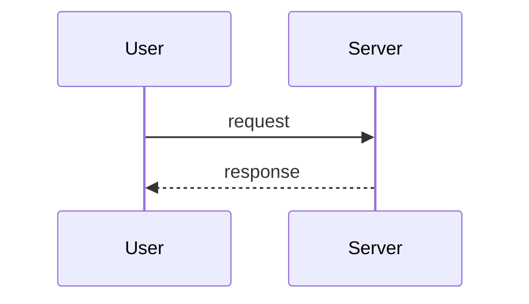

This post is both a demo and a cheat sheet. Open
[its source](https://github.com/gudurumanoj/gudurumanoj.github.io/blob/master/content/blog/building-blocks/manlog-feature-tour/index.md)
side by side with the rendered page to see how each piece is written. Hover over the
ticks on the right edge of the screen to jump between sections.

## Text and formatting

Regular Markdown works as expected: **bold**, *italic*, `inline code`,
[links](https://gohugo.io/), and footnotes.[^1]

> Block quotes are good for definitions or a quote from a paper.

- Bullet lists
- with several items
  - and nesting

1. Numbered lists
2. work too

| Model | Params | Notes |
|-------|-------:|-------|
| Small | 125M   | fits on a laptop |
| Large | 70B    | needs a cluster  |

<details>
<summary>Click to expand a collapsible section</summary>

Raw HTML is allowed, so `<details>` works for long proofs or optional asides.

</details>

## Images and GIFs

Images live in the same folder as the post and are referenced by file name:



For a caption under the image, use Hugo's built-in `figure` shortcode:



GIFs are just images:


For longer animations, an MP4 is far smaller than a GIF. The `video` shortcode plays it
looped and muted, like a GIF: ``.

## Code and commands

Fenced code blocks get syntax highlighting and a copy button:

```python
import torch

def softmax(x: torch.Tensor, dim: int = -1) -> torch.Tensor:
    x = x - x.max(dim=dim, keepdim=True).values  # numerical stability
    return x.exp() / x.exp().sum(dim=dim, keepdim=True)
```

```bash
hugo new blog/ml/my-new-post/index.md
hugo server -D
```

## Math

Inline math uses single dollars, like $e^{i\pi} + 1 = 0$, or `\( ... \)`.
Display math uses double dollars or `\[ ... \]`:

$$
\mathrm{softmax}(z)_i = \frac{e^{z_i}}{\sum_{j=1}^{K} e^{z_j}}
$$

\[
\mathcal{L}(\theta) = -\mathbb{E}_{(x,y)\sim\mathcal{D}}\left[\log p_\theta(y \mid x)\right]
\]

Aligned equations work too:

$$
\begin{aligned}
\nabla_\theta \mathcal{L} &= \mathbb{E}\left[\nabla_\theta \log p_\theta(y\mid x)\right] \\
\theta_{t+1} &= \theta_t - \eta \, \nabla_\theta \mathcal{L}
\end{aligned}
$$

Math is rendered to HTML when the site is built, so pages load fast and nothing flickers.

### Writing a literal dollar sign

To show a dollar sign as plain text, escape it with a backslash: \$5 per GPU-hour.

## Diagrams with Mermaid

Write a fenced block with the language set to `mermaid`:





Diagrams follow the light/dark toggle in the header.

## Interactive demos

Any self-contained HTML file in the post folder can be embedded. This is how to include
a Claude artifact: ask Claude to export the artifact as a single standalone HTML file,
save it next to the post, and embed it:



## Callouts and long sections

### A subsection

Subsections (`###`) show up as shorter ticks in the contents rail and are indented in
the hover panel.

### Another subsection

Posts with fewer than three headings don't show the rail. To hide it on a specific
post, set `toc: false` in the front matter.

## Wrapping up

That covers the building blocks. See `WRITING.md` in the repository for the full guide.

[^1]: Footnotes are collected at the bottom of the post.
