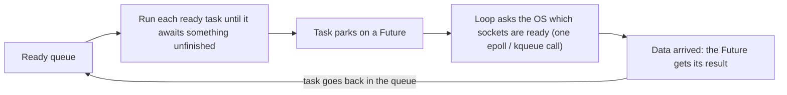
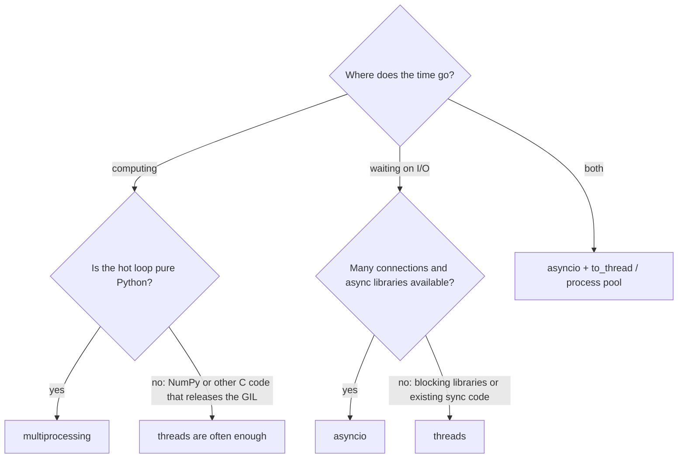

Python has three ways to do more than one thing at a time: **threads**, **processes**, and
**asyncio**. They look interchangeable from the outside, but they solve different problems, and
picking the wrong one either gives you no speedup at all or makes things slower.

This post starts with the one-screen answer and code you can copy. The rest goes under the hood:
the GIL, how each model actually works, where each one breaks, a tiny event loop written from
scratch, how real systems combine them, and the questions interviewers like to ask.

## The short answer

| Your workload | Use | Why |
|---------------|-----|-----|
| CPU-heavy pure Python (math, parsing, simulation) | **multiprocessing** | Each process has its own GIL, so the work runs on several cores at once |
| Many concurrent network operations, async libraries available | **asyncio** | One thread juggles thousands of paused tasks cheaply |
| Some waiting, with ordinary blocking libraries (`requests`, `boto3`, DB drivers) | **threads** | Blocking I/O releases the GIL, and nothing needs rewriting |
| Both kinds of work | **asyncio + executors** | The loop handles I/O; CPU work goes to a process pool |

**Threads**, for I/O with blocking libraries:

```python
from concurrent.futures import ThreadPoolExecutor
import requests

def download(url):
    return requests.get(url, timeout=10).text     # blocks, but releases the GIL while waiting

with ThreadPoolExecutor(max_workers=20) as pool:
    pages = list(pool.map(download, urls))
```

**Processes**, for CPU-heavy Python:

```python
from concurrent.futures import ProcessPoolExecutor

def crunch(n):
    return sum(i * i for i in range(n))            # pure-Python CPU work

if __name__ == "__main__":                          # required: workers may re-import this file
    with ProcessPoolExecutor() as pool:             # one worker per core by default
        results = list(pool.map(crunch, [10**7] * 8))
```

**Asyncio**, for thousands of concurrent connections:

```python
import asyncio
import httpx

async def fetch(client, url):
    response = await client.get(url)                # pauses this task; other fetches run meanwhile
    return response.status_code

async def main(urls):
    async with httpx.AsyncClient() as client:
        return await asyncio.gather(*(fetch(client, u) for u in urls))

codes = asyncio.run(main(urls))
```

(`requests` and `httpx` are third-party: `pip install requests httpx`.)

Here is what each one looks like over time:

<figure class="ml-diagram">
<svg viewBox="0 0 860 604" role="img" aria-label="Timelines: threads take turns on CPU work, processes run in parallel, threads and asyncio overlap their I/O waits">
  <defs><marker id="ml-arrow" viewBox="0 0 10 10" refX="9" refY="5" markerWidth="7" markerHeight="7" orient="auto-start-reverse"><path d="M0,0 L10,5 L0,10 z"/></marker></defs>
  <rect class="box" x="210" y="20" width="26" height="14" rx="3"/>
  <text class="note left" x="244" y="32">filled: running Python code</text>
  <rect class="group" x="430" y="20" width="26" height="14" rx="3"/>
  <text class="note left" x="464" y="32">waiting on I/O (GIL released)</text>
  <text class="name left" x="20" y="80">Threads, CPU-bound</text>
  <text class="note left" x="40" y="112">thread 1</text>
  <rect class="box violet" x="210" y="96" width="61" height="22" rx="4"/>
  <rect class="box violet" x="336" y="96" width="61" height="22" rx="4"/>
  <rect class="box violet" x="462" y="96" width="61" height="22" rx="4"/>
  <rect class="box violet" x="588" y="96" width="61" height="22" rx="4"/>
  <rect class="box violet" x="714" y="96" width="61" height="22" rx="4"/>
  <text class="note left" x="40" y="144">thread 2</text>
  <rect class="box violet" x="273" y="128" width="61" height="22" rx="4"/>
  <rect class="box violet" x="399" y="128" width="61" height="22" rx="4"/>
  <rect class="box violet" x="525" y="128" width="61" height="22" rx="4"/>
  <rect class="box violet" x="651" y="128" width="61" height="22" rx="4"/>
  <rect class="box violet" x="777" y="128" width="61" height="22" rx="4"/>
  <text class="name left" x="20" y="184">Processes, CPU-bound</text>
  <text class="note left" x="40" y="216">process 1 (core 1)</text>
  <rect class="box green" x="210" y="200" width="630" height="22" rx="4"/>
  <text class="note left" x="40" y="248">process 2 (core 2)</text>
  <rect class="box green" x="210" y="232" width="630" height="22" rx="4"/>
  <text class="note left" x="40" y="280">process 3 (core 3)</text>
  <rect class="box green" x="210" y="264" width="630" height="22" rx="4"/>
  <text class="name left" x="20" y="320">Threads, I/O-bound</text>
  <text class="note left" x="40" y="352">thread 1</text>
  <rect class="box violet" x="210" y="336" width="36" height="22" rx="4"/>
  <rect class="group" x="250" y="336" width="400" height="22" rx="4"/>
  <rect class="box violet" x="654" y="336" width="36" height="22" rx="4"/>
  <text class="note left" x="40" y="384">thread 2</text>
  <rect class="box violet" x="250" y="368" width="36" height="22" rx="4"/>
  <rect class="group" x="290" y="368" width="400" height="22" rx="4"/>
  <rect class="box violet" x="694" y="368" width="36" height="22" rx="4"/>
  <text class="note left" x="40" y="416">thread 3</text>
  <rect class="box violet" x="290" y="400" width="36" height="22" rx="4"/>
  <rect class="group" x="330" y="400" width="400" height="22" rx="4"/>
  <rect class="box violet" x="734" y="400" width="36" height="22" rx="4"/>
  <text class="name left" x="20" y="456">Asyncio, I/O-bound (one thread)</text>
  <text class="note left" x="40" y="488">task A</text>
  <rect class="box rose" x="210" y="472" width="36" height="22" rx="4"/>
  <text class="note" x="228" y="488">A</text>
  <rect class="group" x="250" y="472" width="400" height="22" rx="4"/>
  <rect class="box rose" x="654" y="472" width="36" height="22" rx="4"/>
  <text class="note" x="672" y="488">A</text>
  <text class="note left" x="40" y="520">task B</text>
  <rect class="box rose" x="250" y="504" width="36" height="22" rx="4"/>
  <text class="note" x="268" y="520">B</text>
  <rect class="group" x="290" y="504" width="400" height="22" rx="4"/>
  <rect class="box rose" x="694" y="504" width="36" height="22" rx="4"/>
  <text class="note" x="712" y="520">B</text>
  <text class="note left" x="40" y="552">task C</text>
  <rect class="box rose" x="290" y="536" width="36" height="22" rx="4"/>
  <text class="note" x="308" y="552">C</text>
  <rect class="group" x="330" y="536" width="400" height="22" rx="4"/>
  <rect class="box rose" x="734" y="536" width="36" height="22" rx="4"/>
  <text class="note" x="752" y="552">C</text>
  <line class="arrow" x1="210" y1="572" x2="840" y2="572"/>
  <text class="label" x="820" y="594">time</text>
</svg>
<figcaption>Threads take turns on CPU work because of the GIL. Processes run truly in parallel. For I/O, threads and asyncio both overlap the waiting; asyncio does it on one thread, switching only at <code>await</code>.</figcaption>
</figure>

## Two ideas that explain everything

### Concurrency vs parallelism

- **Concurrency** is juggling several tasks, with their progress interleaved over time. One cook
  stirring three pots in turn is concurrency.
- **Parallelism** is doing several things at the same instant on separate CPU cores. Three cooks
  each stirring a pot is parallelism.

Threads and asyncio give you concurrency. Only processes reliably give you parallelism for
Python code (until free-threaded Python becomes the norm, see the end).

### CPU-bound vs I/O-bound

- **CPU-bound** work is limited by how fast the CPU computes: number crunching, parsing,
  compression, image processing in pure Python.
- **I/O-bound** work is limited by waiting on something else: network responses, disk reads,
  database queries. The CPU mostly sits idle during the wait.

Which tool is right depends almost entirely on which kind of work you have.

## The GIL

CPython, the standard interpreter, has a **Global Interpreter Lock**. It is a mutex, and a
thread must hold it to execute Python bytecode.

It exists because CPython manages memory with **reference counting**: every object carries a
counter of how many references point to it, and the object is freed when the counter hits zero.

```python
import sys
x = []
sys.getrefcount(x)   # 2: the name x, plus the temporary reference passed to getrefcount
```

Those counters change constantly, on almost every line. Without a lock, two threads updating
the same counter at once could corrupt it, freeing memory that is still in use or leaking it.
One big lock was the simple, fast answer for single-threaded code.

The consequence: **only one thread per process runs Python bytecode at any moment**, however
many cores you have. But the GIL is released in exactly the places that matter for I/O:

- **Blocking I/O**: `socket.recv`, `file.read`, `time.sleep`, waiting on a subprocess.
- **Many C extensions during heavy computation**: NumPy, `hashlib`, `zlib`, and many image and
  crypto libraries.
- **Periodically**: a thread that holds the GIL is asked to drop it after the *switch interval*
  (`sys.getswitchinterval()`, 5 ms by default) if another thread is waiting.

### Measuring it

Numbers make this concrete. This script runs the same work sequentially, with threads, with
processes, and with asyncio. `time.sleep` stands in for a network call, since both block and
release the GIL:

```python
import asyncio, time
from concurrent.futures import ProcessPoolExecutor, ThreadPoolExecutor

def crunch(n):
    return sum(i * i for i in range(n))

def wait(seconds):
    time.sleep(seconds)

def timed(label, fn):
    start = time.perf_counter()
    fn()
    print(f"{label:<24} {time.perf_counter() - start:5.2f} s")

if __name__ == "__main__":
    jobs = [5_000_000] * 4
    timed("CPU, sequential", lambda: [crunch(n) for n in jobs])
    timed("CPU, 4 threads", lambda: list(ThreadPoolExecutor(4).map(crunch, jobs)))
    timed("CPU, 4 processes", lambda: list(ProcessPoolExecutor(4).map(crunch, jobs)))

    delays = [0.5] * 20
    timed("I/O, sequential", lambda: [wait(d) for d in delays])
    timed("I/O, 20 threads", lambda: list(ThreadPoolExecutor(20).map(wait, delays)))

    async def main():
        await asyncio.gather(*(asyncio.sleep(d) for d in delays))
    timed("I/O, asyncio", lambda: asyncio.run(main()))
```

On my Linux machine with Python 3.13:

| Workload | Sequential | Threads | Processes | Asyncio |
|----------|-----------:|--------:|----------:|--------:|
| CPU: 4 × `crunch(5_000_000)` | 1.13 s | 1.07 s | **0.37 s** | n/a |
| I/O: 20 × 0.5 s wait | 10.00 s | **0.50 s** | n/a | **0.50 s** |

Threads did nothing for the CPU work: the GIL made them take turns. Processes were about 3×
faster, not 4×, because starting workers and pickling arguments costs time. For waiting, threads
and asyncio both overlapped all twenty waits, finishing in the time of one.

## Multithreading

### How it works

- `threading.Thread` creates a **real OS thread** (a pthread on Linux). The OS decides when each
  one runs, so scheduling is **preemptive**: a thread can be paused at almost any point.
- All threads live in one process and **share memory**: the same globals, heap and objects.
  Sharing data is trivial, and that is both the convenience and the danger.
- While thread A waits on the network, it has released the GIL, so thread B runs. That is why
  threads work well for I/O despite the GIL.

### Race conditions

`counter += 1` looks like one step, but it is several bytecode instructions:

```text
LOAD_GLOBAL   counter     # read
LOAD_CONST    1
BINARY_OP     +=          # add
STORE_GLOBAL  counter     # write
```

If a thread switch lands between the read and the write, two threads read the same old value
and one update is lost. In practice, recent CPython versions only check for a thread switch at
certain points (function calls, loop jumps), so a tight `counter += 1` loop across four threads
usually *happens* to print the right total. I got exactly 4,000,000 on 3.11, 3.12 and 3.13.
Nothing guarantees it, though, and as soon as anything that releases the GIL sits between the
read and the write, updates vanish:

```python
import threading, time

balance = 0

def deposit():
    global balance
    for _ in range(100):
        current = balance        # read
        time.sleep(0)            # any I/O here lets another thread run
        balance = current + 1    # write back a stale value

threads = [threading.Thread(target=deposit) for _ in range(4)]
for t in threads: t.start()
for t in threads: t.join()
print(balance)                   # expected 400; I got 105
```

The fix is a lock around the read-modify-write, so only one thread is inside it at a time:

```python
lock = threading.Lock()

def deposit():
    global balance
    for _ in range(100):
        with lock:
            current = balance
            time.sleep(0)
            balance = current + 1    # now always 400
```

Locks bring their own problems (deadlocks, contention, bugs that only appear under load), so
where possible, avoid shared mutable state: pass work and results through a `queue.Queue`, or
let `ThreadPoolExecutor` return results instead of writing to globals.

### Practical notes

- **Default pool size**: `ThreadPoolExecutor()` uses `min(32, cpu_count + 4)` workers. For I/O,
  size it to how many requests you want in flight, not to your core count.
- **Exceptions are stored, not raised**. A worker's exception is re-raised when you call
  `future.result()` (or iterate `pool.map`). If you never look, failures are silent:

  ```python
  from concurrent.futures import ThreadPoolExecutor, as_completed

  with ThreadPoolExecutor(max_workers=20) as pool:
      futures = {pool.submit(download, url): url for url in urls}
      for future in as_completed(futures):       # yields futures as they finish
          try:
              page = future.result()              # re-raises the worker's exception
          except Exception as exc:
              print(f"{futures[future]} failed: {exc}")
  ```

- **You can't kill a thread** from outside. Build in a stop flag (`threading.Event`) that the
  thread checks.

### Limits

- **No parallelism for pure-Python CPU work.** The GIL serializes it, and the switching adds
  overhead, so threads are no faster and sometimes slower than one thread.
- **Cost per thread.** Each thread reserves a stack (often 8 MB of *virtual* memory on Linux,
  far less actually used) and a kernel scheduling entry. Hundreds are fine; tens of thousands get
  expensive.
- **Races and deadlocks**, as above.

## Multiprocessing

### How it works

Each worker is a **separate OS process** with its own interpreter, its own memory and its own
GIL. The OS runs them on different cores, so you get true parallelism.

How a child process is created depends on the **start method**:

| Method | What it does | Trade-off | Default on |
|--------|--------------|-----------|------------|
| `fork` | Copies the parent process (copy-on-write) | Fast, but unsafe if the parent has threads; Python 3.12+ warns | Linux, up to 3.13 |
| `spawn` | Starts a fresh interpreter and re-imports your main module | Slowest, safest | macOS, Windows |
| `forkserver` | Forks from a clean helper process started early | Safe and fairly fast | Linux, since 3.14 |

`spawn` is why the `if __name__ == "__main__":` guard matters: without it, each child re-runs
your top-level code on import, including the line that creates the pool. You can choose a
method explicitly with `ProcessPoolExecutor(mp_context=multiprocessing.get_context("spawn"))`.

### Moving data between processes

Processes don't share memory, so arguments and return values are **pickled** (serialized), sent
through a pipe, and unpickled on the other side. That has consequences:

- **Not everything pickles.** Lambdas, functions defined inside other functions, open sockets,
  database connections and locks generally can't be sent to a worker. Define worker functions at
  module top level.
- **Big data is expensive to move.** Sending a 1 GB array to each worker copies it each time.
  For large arrays, use `multiprocessing.shared_memory` (workers attach to the same buffer by
  name). `Value`, `Array` and `Manager` objects exist for shared state too; a `Manager` is a proxy
  server, so it is the slowest.
- **Tiny tasks drown in overhead.** `ProcessPoolExecutor.map` sends one item per message by
  default. For many small items, batch them with `pool.map(fn, items, chunksize=1000)`.

### Limits

- **Heavy startup**: milliseconds to tens of milliseconds per process, and tens of MB of RAM
  each, because every process loads an interpreter plus your imports.
- **Scales with cores, not tasks**: more processes than cores doesn't help CPU work, and it is
  no way to handle 10,000 connections.
- **Awkward shared state**: you design around message passing instead of shared variables.
- **Platform quirks**: `spawn` re-imports modules; mixing `fork` with threads can deadlock.

One upside the others can't match: **isolation**. A segfault or memory leak in one worker
doesn't take down the rest.

## Asyncio

### How it works

**One thread, one event loop.** No parallelism at all, just very efficient concurrency.

- `async def` defines a **coroutine function**. Calling it returns a coroutine object that can
  pause at every `await`. When it pauses, its state (local variables, position in the code) is
  saved in a small Python object, not on an OS thread stack.
- A **Task** wraps a coroutine so the loop can run it. A **Future** is a placeholder for a
  result that isn't available yet.
- Switching is **cooperative**: a task only gives up control at an `await`. Nothing can
  interrupt it mid-statement.

The event loop repeats one cycle:



That single OS call watches thousands of sockets at once, and the loop only wakes the tasks that
have something to do. Switching between tasks is a cheap jump in user space, with no kernel
context switch.

To see exactly what happens during one `await` on a socket, step through this walkthrough with
**Next**. The highlighted boxes are the ones doing something in that step. Watch for two
hookups: at step 3 the socket is linked to a Future (in the loop's socket map), and at step 5
the Future is linked to the Task (in its callback list). Together they form the chain the loop
follows back to your coroutine. From step 5 to step 10 the Task is not in the ready queue at
all: it is parked, and nothing checks on it. Only the Future completing at step 9 puts it back.
Everything in the bottom row happens in the kernel while your Python thread sleeps.



### Writing asyncio well

The basic `gather` example from the top works, but real code needs a few more things:

```python
import asyncio
import httpx

async def fetch(client, limit, url):
    async with limit:                              # at most 50 requests in flight
        async with asyncio.timeout(10):            # give up on slow servers (3.11+)
            response = await client.get(url)
            return response.status_code

async def main(urls):
    limit = asyncio.Semaphore(50)
    async with httpx.AsyncClient() as client:
        async with asyncio.TaskGroup() as tg:      # waits for all tasks (3.11+)
            tasks = [tg.create_task(fetch(client, limit, u)) for u in urls]
    return [t.result() for t in tasks]
```

- **Cap concurrency** with a `Semaphore`. A bare `gather` over 100,000 URLs opens 100,000
  connections at once.
- **Set timeouts.** A request that never returns holds its task forever.
- **`TaskGroup` vs `gather`**: if one task in a `TaskGroup` fails, the rest are cancelled and the
  error propagates. If you'd rather collect failures and keep going, use
  `asyncio.gather(..., return_exceptions=True)`.
- **Blocking code goes to a thread**: `await asyncio.to_thread(blocking_call, arg)`.
- **Keep a reference to tasks** made with `asyncio.create_task`. The loop holds only a weak
  reference, so an unreferenced task can be garbage-collected mid-flight.
- **Debug mode** (`asyncio.run(main(), debug=True)`) logs any step that holds the loop for more
  than 100 ms and warns about coroutines that were never awaited.

### Limits

- **No parallelism.** CPU-bound code gains nothing.
- **One blocking call freezes everything.** A `time.sleep(2)`, a `requests.get()` or a heavy
  loop inside a coroutine stalls every other task, because nothing runs until that code reaches
  an `await`.
- **Needs async libraries** (`httpx`/`aiohttp`, `asyncpg`, ...). A blocking library breaks the
  model unless you push it to a thread.
- **Function colouring.** To `await` something, the caller must be `async` too, and so must its
  caller. Retrofitting an existing synchronous codebase is invasive.
- **Races still exist at `await` boundaries.** Much rarer than with threads, but state can change
  between two `await`s.

## Under the hood: an event loop in under 100 lines

The fastest way to understand asyncio is to build a tiny one. This script reads two files
"concurrently" without importing asyncio. Each read has a pretend slow disk (1.0 s and 0.5 s), so
you can watch the waiting.

There are only three pieces:

- **`Future`**: its `__await__` does `yield self`, the only place anything ever pauses. The
  yielded Future travels up through `await` to whoever called `coro.send()`.
- **`Task`**: calls `coro.send(None)` to run the coroutine until it yields a Future, then parks
  itself on that Future. It does not reschedule itself; the Future will.
- **The loop**: runs every ready task, then sleeps until a read finishes, completes that read's
  Future, and repeats.

```python
"""A tiny event loop that reads two files "concurrently", without asyncio."""
import queue
import threading
import time
from collections import deque

WRONG_WAY = False                    # True: read the file directly inside the coroutine

START = time.perf_counter()


def log(msg):
    print(f"[{time.perf_counter() - START:.2f}s] {msg}")


class Future:
    """A result that isn't ready yet, plus the one task waiting for it."""

    def __init__(self):
        self.done = False
        self.result = None
        self.waiting_task = None

    def set_result(self, value):
        self.done, self.result = True, value
        if self.waiting_task:
            ready.append(self.waiting_task)      # wake the task that awaited us

    def __await__(self):
        if not self.done:
            yield self                           # the ONLY place a coroutine pauses
        return self.result


class Task:
    """Drives one coroutine, one step at a time."""

    def __init__(self, coro, name):
        self.coro, self.name = coro, name
        ready.append(self)

    def step(self):
        log(f"task {self.name}: running")
        try:
            future = self.coro.send(None)        # run until the next `yield self`
        except StopIteration as stop:
            log(f"task {self.name}: finished, got {stop.value!r}")
            return
        future.waiting_task = self               # park; the Future will requeue us
        log(f"task {self.name}: paused on a read")


ready = deque()            # tasks that can run right now
finished = queue.Queue()   # (future, data) pairs handed over by worker threads
in_flight = 0              # reads that haven't finished yet


def slow_read(path, delay):
    time.sleep(delay)                            # pretend the disk is slow
    with open(path) as f:
        return f.read()


def read_file(path, delay):
    """Start a read on a worker thread and return a Future for its result."""
    global in_flight
    in_flight += 1
    future = Future()
    threading.Thread(target=lambda: finished.put((future, slow_read(path, delay)))).start()
    return future


async def reader(path, delay):
    if WRONG_WAY:
        return slow_read(path, delay)            # blocks the only thread
    return await read_file(path, delay)          # pauses just this task


def run():
    global in_flight
    while ready or in_flight:
        while ready:                             # 1. run everything that can run
            ready.popleft().step()
        if in_flight:                            # 2. nothing can run: sleep until a read finishes
            log("loop: nothing ready, sleeping")
            future, data = finished.get()        #    (asyncio would call epoll/kqueue here)
            in_flight -= 1
            future.set_result(data)              # 3. complete the Future, which requeues its task


if __name__ == "__main__":
    for name in ("a", "b"):
        with open(f"{name}.txt", "w") as f:
            f.write(f"hello from {name}")
    Task(reader("a.txt", 1.0), "A")
    Task(reader("b.txt", 0.5), "B")
    run()
    log("all done")
```

Output:

```text
[0.00s] task A: running
[0.00s] task A: paused on a read
[0.00s] task B: running
[0.00s] task B: paused on a read
[0.00s] loop: nothing ready, sleeping
[0.50s] task B: running
[0.50s] task B: finished, got 'hello from b'
[0.50s] loop: nothing ready, sleeping
[1.00s] task A: running
[1.00s] task A: finished, got 'hello from a'
[1.00s] all done
```

Both tasks start, ask for a read, and pause at 0.00 s. The loop then sleeps. B's read finishes
first, so B resumes at 0.50 s even though it started second. A resumes at 1.00 s. Total: 1.0 s,
because both reads were waiting at the same time.

Now set `WRONG_WAY = True`. The coroutine is still `async def`, but it reads the file directly:

```text
[0.00s] task A: running
[1.00s] task A: finished, got 'hello from a'
[1.00s] task B: running
[1.50s] task B: finished, got 'hello from b'
[1.50s] all done
```

Task A holds the only thread for the full second, and B can't even start until A is done. Total:
1.5 s, the same as plain sequential code. **Writing `async def` doesn't make code concurrent.
Only awaiting something that actually pauses does.**

How real asyncio differs:

- For **sockets**, there are no worker threads. Sockets are non-blocking, and the loop asks the
  OS which ones are ready through `selectors` (epoll on Linux, kqueue on macOS). That call is
  where the thread sleeps, playing the role of `finished.get()` here.
- A Future keeps a **list of callbacks** instead of one waiting task, and there is a heap of
  **timers** for `asyncio.sleep`.
- When a worker thread finishes (`asyncio.to_thread`), it wakes the sleeping loop with
  `call_soon_threadsafe`, which writes a byte to a "self-pipe" the loop is watching.
- For **regular files**, real asyncio does exactly what this toy does. Operating systems don't
  report readiness for disk files the way they do for sockets, so `aiofiles` and
  `asyncio.to_thread` push file reads onto threads.

To watch it work, add a `print` in `Future.set_result` and in the `run` loop, or add a third file
with a 0.2 s delay and predict the order before running it.

## Picking one



**1. CPU-bound pure Python → multiprocessing.** Threads fail because the GIL lets one thread run
bytecode at a time: four threads on four cores still get one core's worth of Python. Asyncio
fails because it is one thread, and a long computation never reaches an `await`, so it freezes
every other task too. Processes each have their own GIL and run on separate cores. Give each
worker a chunky task so startup and pickling costs stay small in comparison.

**2. Massive I/O concurrency (a web server, a scraper, websockets, chat) → asyncio.** A thread
per connection means 10,000 threads: lots of stack memory, heavy kernel scheduling and costly
context switches, plus all the locking risk. A process per connection is absurd
(10,000 × tens of MB) and adds CPU you don't need. With asyncio, each waiting connection is a
small paused object, one OS call watches every socket, and switches only happen at `await`.

**3. Moderate I/O with blocking libraries, or adding concurrency to existing sync code →
threads.** Asyncio would need a rewrite (or `to_thread` everywhere, which is threads anyway).
Processes are overkill: you'd pay startup and pickling costs to parallelize waiting, which needs
no extra CPU. Threads just work, because blocking I/O releases the GIL, and results come back in
shared memory.

**4. CPU work inside GIL-releasing C libraries (NumPy, OpenCV, Pillow, hashing, compression) →
threads are often enough.** These libraries drop the GIL while their C code runs, so threads
really do run in parallel, and you avoid copying large arrays between processes.

**5. Mixed workload (an async server that sometimes computes) → combine them.** Asyncio handles
the connections; CPU work and blocking calls are handed off so they don't stall the loop:

```python
import asyncio
from concurrent.futures import ProcessPoolExecutor

process_pool = ProcessPoolExecutor()

async def handle(request):
    loop = asyncio.get_running_loop()
    report = await loop.run_in_executor(process_pool, crunch, 10**7)   # CPU work on another core
    data = await asyncio.to_thread(blocking_sdk_call)                  # blocking library on a thread
    return report, data
```

**6. You need isolation (a crash or leak shouldn't take everything down) → multiprocessing.**
Threads and coroutines share one process, so a segfault in any of them kills all of them.

### Side by side

| | Threads | Processes | Asyncio |
|---|---|---|---|
| Unit of work | OS thread | OS process | Coroutine / Task |
| Scheduling | Preemptive (OS) | Preemptive (OS) | Cooperative (at `await`) |
| True parallelism | No (GIL), except GIL-releasing C code | Yes | No |
| Memory | Shared | Separate (IPC + pickling) | Shared, single thread |
| Cost per unit | KBs–MBs, OS-managed | Tens of MB, slow start | ~1–2 KB object |
| Practical scale | Hundreds | About the number of cores | Tens of thousands |
| Race risk | High (switch anywhere) | Low (no shared memory) | Low (switch only at `await`) |
| Works with blocking libraries | Yes | Yes | No (blocks the loop) |
| Best for | Moderate I/O with blocking libraries | CPU-bound work | Massive I/O concurrency |

## How real systems combine them

Production Python rarely uses just one model:

- **Web servers**: Gunicorn runs several worker *processes* (one or two per core); with
  Uvicorn workers, each process runs an *asyncio* event loop. Processes use the cores, and the
  event loops handle the connections.
- **FastAPI**: `async def` endpoints run on the event loop, while plain `def` endpoints run in a
  *thread* pool so blocking code inside them doesn't freeze the server.
- **PyTorch**: `DataLoader(num_workers=8)` loads and augments batches in 8 worker *processes*,
  so CPU-heavy preprocessing runs in parallel with training.
- **Celery**: workers use a pool of *processes* by default; for I/O-heavy tasks you can switch
  to green-thread pools (gevent, eventlet).

## Where things are heading

- **Free-threaded Python.** PEP 703 added an optional CPython build without the GIL:
  experimental in 3.13, officially supported (but not the default) in 3.14. On that build
  (`python3.13t`, `python3.14t`), threads run pure-Python CPU work in parallel, which erodes the
  main reason to use multiprocessing. Single-threaded code runs somewhat slower, and some C
  extensions aren't compatible yet. `sys._is_gil_enabled()` tells you which build you're on.
- **Subinterpreters.** Python 3.12 gave each subinterpreter its own GIL, and 3.14 added
  `concurrent.interpreters` and `InterpreterPoolExecutor` to use them from Python code: several
  interpreters in one process, running in parallel with less overhead than processes, but still
  with restricted data sharing.

For most code today, you're on the standard GIL build, so the rules above still apply.

## Interview questions

<details>
<summary>What's the difference between concurrency and parallelism?</summary>

Concurrency is making progress on several tasks by interleaving them (one cook, three pots).
Parallelism is running several tasks at the same instant on different cores (three cooks).
Threads and asyncio give concurrency; processes give parallelism.

</details>

<details>
<summary>What is the GIL, and why does CPython have it?</summary>

A mutex that a thread must hold to run Python bytecode, so only one thread per process executes
Python at a time. It protects CPython's reference counts (and other interpreter state) from
concurrent updates, and it keeps single-threaded code fast and C extensions simple.

</details>

<details>
<summary>If only one thread runs at a time, why do threads speed anything up?</summary>

Because the GIL is released during blocking I/O and inside many C extensions. While one thread
waits on the network, another runs, so the waits overlap. They don't help pure-Python CPU work.

</details>

<details>
<summary>Is <code>counter += 1</code> thread-safe?</summary>

No. It compiles to a separate read, add and write, and a thread switch between the read and the
write loses an update. It may *appear* safe on recent CPython because switches happen only at
certain points, but that is not guaranteed (and certainly not on free-threaded builds). Use a
`Lock`, or avoid shared state with a `Queue`.

</details>

<details>
<summary>You need to download 10,000 URLs. What do you use?</summary>

asyncio with an async HTTP client (`httpx`, `aiohttp`), a `Semaphore` to cap requests in flight,
and timeouts. If the code must use `requests`, a `ThreadPoolExecutor` with a few dozen workers.
Not multiprocessing: the work is waiting, not computing.

</details>

<details>
<summary>You need to parse 500 GB of logs in pure Python. What do you use?</summary>

multiprocessing (`ProcessPoolExecutor`), one worker per core, each handed a large chunk (a file
or byte range) rather than single lines, so pickling and messaging overhead stays small.

</details>

<details>
<summary>What happens if you call <code>time.sleep(2)</code> inside a coroutine?</summary>

The whole event loop stops for two seconds: no other task runs, because control only returns
to the loop at an `await`. Use `await asyncio.sleep(2)`, and move any other blocking call to
`asyncio.to_thread`.

</details>

<details>
<summary>How do you call blocking or CPU-heavy code from asyncio?</summary>

Blocking I/O: `await asyncio.to_thread(fn, *args)`. CPU-heavy work:
`await loop.run_in_executor(process_pool, fn, *args)` with a `ProcessPoolExecutor`, so it runs on
another core instead of freezing the loop.

</details>

<details>
<summary>fork vs spawn, and why do you need <code>if __name__ == "__main__"</code>?</summary>

`fork` copies the parent process (fast, but unsafe if the parent has threads). `spawn` starts a
fresh interpreter that re-imports your main module. Without the guard, that re-import would run
your top-level code again, including creating the pool, in every child.

</details>

<details>
<summary>Why can't you pass a lambda to <code>ProcessPoolExecutor</code>?</summary>

Arguments are pickled to send them to the worker, and pickle stores functions by their
importable name. Lambdas and nested functions have no importable name, so they can't be pickled.
Define the function at module top level.

</details>

<details>
<summary><code>asyncio.gather</code> or <code>TaskGroup</code>?</summary>

`TaskGroup` (3.11+) is the safer default: if one task fails, it cancels the others and raises.
`gather` lets the other tasks keep running when one fails, and with `return_exceptions=True` it
returns errors as values so you can handle each one.

</details>

<details>
<summary>Does free-threaded Python make multiprocessing obsolete?</summary>

Not yet. It is optional in 3.14, single-threaded code is a bit slower, and some C extensions
don't support it. Multiprocessing also still offers crash isolation. But for CPU-bound work in a
free-threaded build, threads become a real option.

</details>

## Summary

- Decide by workload: **CPU-bound → processes**, **lots of waiting with async libraries →
  asyncio**, **some waiting with blocking libraries → threads**, **both → asyncio plus
  executors**.
- The GIL lets one thread run Python bytecode at a time but is released during I/O, which is why
  threads help with waiting and not with computing.
- Processes buy real parallelism with startup, memory and pickling costs.
- Asyncio is one thread switching cooperatively at `await`. It scales to huge numbers of
  connections, but one blocking call freezes everything.
- Under the hood, asyncio is three small ideas: a Future that yields itself, a Task that drives a
  coroutine with `send()`, and a loop that sleeps until the OS reports something is ready.
